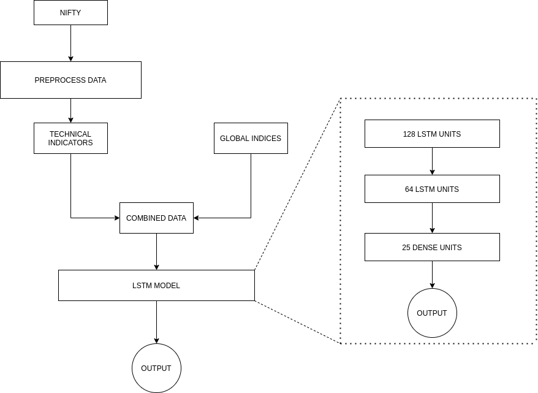

# HybridLSTM_For_NIFTY_predictions
Used long short-term memory networks to conduct 3 experiments for predicting future prices of the NIFTY50 index using 20 technical indicators, 13 global indices and a combination of both. The performance was evaluated on MSE, MAE and R2 score.

Publication Link: https://ieeexplore.ieee.org/document/9579732

### Architecture of HybridLSTM model:

